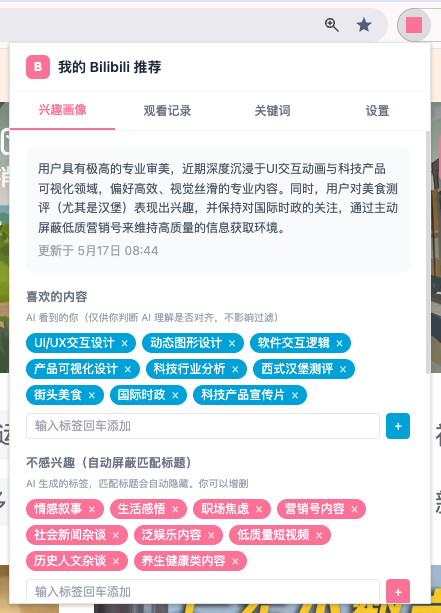

# 我的 Bilibili 推荐 · My Bilibili Rcmd

一个 B 站推荐管理扩展，加上一个让 LLM 看你观看行为的实验。



## 这是什么

B 站推荐流刷久了越来越糟，原生「不感兴趣」感觉点了也没用。所以试着写了这个扩展自用，做两件事：

1. **一个规则明确的推荐管理工具**：手输关键词屏蔽、一键屏蔽 UP、卡片上的快捷按钮，你说屏蔽就屏蔽，不会和你对着干
2. **一个让 LLM 帮你看自己的实验**：每攒几条观看行为交给 LLM 分析一次，生成"AI 看到的你"，给你一些标签和一段总结

**注意：今天真正在过滤推荐的主要是 #1 那些手动信号**（你点了什么、屏蔽了谁、加了什么关键词）。#2 的 AI 画像目前更像一面镜子，让你看到 LLM 怎么读你最近的观看；它生成的标签偶尔会命中标题（子串匹配），但概念级标签（"营销号内容"）和具体标题之间命中率有限。

把它当成「**好用的过滤器 + 一个 AI 自我观察实验**」就比较准确。

## 它能帮你做什么（今天就工作的部分）

- **手输关键词屏蔽**：标题包含就隐藏，立即生效。比如某段时间不想刷到某个突发事件
- **一键屏蔽 UP**：卡片 hover 出"不看TA"，那个 UP 以后的视频都不再出现
- **顺手的"不感兴趣"按钮**：点了之后**同时**会触发 B 站原生「内容不感兴趣」反馈，一次操作既本地记下来、也喂给 B 站算法
- **本地观看记录**：完整保留最近的看了什么、看了多久、完播率多少，B 站自己的 history 不展示完播率


## 它在尝试什么（实验部分）

让 LLM 看你最近 50 条观看行为，生成一份**画像**：

- **interests**：AI 觉得你喜欢的内容类型（标签）
- **disinterests**：AI 觉得你不感兴趣的（标签）
- **blockedUps**：从"不看TA"行为里整理的屏蔽名单
- **analysis**：一段中文总结

画像 tab 把这四样展示给你。**目前主要的价值是：让你看到 LLM 怎么读你**，是个自我观察工具。AI 给出的 disinterests 标签也会用来过滤标题，但偏概念级（"营销号内容"），实际命中率低，别期待它替代手动屏蔽。

接 LLM 三家都行，挑一家：

- [OpenRouter](https://openrouter.ai)：国外，模型最全
- [智谱 GLM](https://open.bigmodel.cn)：国内，低延迟
- [DeepSeek](https://platform.deepseek.com)：国内，低延迟

每次分析约 1-2k tokens，按最便宜档算下来几分钱。

## 隐私

没有服务器，不上报任何东西。

- 观看记录、画像、关键词、设置都只在你的 Chrome 本地存储里
- AI 分析时，用你自己的 API Key 把最近 50 条行为摘要发给你选的那家 LLM
- 卸载扩展数据就没了

## 安装

三种方式，按你方便挑一个：

**1. Chrome 应用商店（最省事）**

直接装：[我的 Bilibili 推荐 · Chrome 应用商店](https://chromewebstore.google.com/detail/%E6%88%91%E7%9A%84-bilibili-%E6%8E%A8%E8%8D%90/fbjfocpchadnanfkiecekebmopfjlpee?utm_source=item-share-cb)

**2. 从 Release 下载 zip**

去 [Releases](https://github.com/aisensiy/my-bilibili-rcmd/releases) 下最新的 zip 解压，然后 chrome://extensions → 开开发者模式 → 加载已解压的扩展 → 选解压出来的文件夹。

**3. 自己构建**

需要 Node.js 和 pnpm（没装 pnpm 的话 `npm i -g pnpm`）。

```bash
git clone https://github.com/aisensiy/my-bilibili-rcmd.git
cd my-bilibili-rcmd
pnpm install
pnpm build
```

然后 chrome://extensions → 开开发者模式 → 加载已解压的扩展 → 选 `dist/`。

---

装完打开扩展会有个引导页让你填 Key 和模型。填完去 B 站正常用，看够 5 个视频 AI 就会自动分析一次。也可以在画像 tab 手动点"立即分析"。

## 局限

- **只在桌面浏览器工作**：本质是 Chrome 扩展，靠在 B 站网页上注入脚本、改 DOM 来做事。手机端的 B 站 App、平板、移动浏览器都用不上。大多数人刷 B 站其实是在手机上，这个限制挺真实
- **过滤是前端的**：推荐流是 B 站后端返回的，扩展只能在浏览器里把不想要的卡片藏起来。意味着你在桌面屏蔽掉某个 UP，去手机刷还是会看到
- **AI 画像短期不会同步到手机**：画像、观看记录都只在你本地 Chrome 里，换电脑也带不走

## 想试的下一步

让 AI 画像**真正驱动**过滤甚至推荐，这是这个项目最想验证、但目前还没做到的地方：

- 让 LLM 生成更可匹配的标签（不只是概念，也包含可能出现在标题里的关键词），提高命中率
- 或者换路径：用 LLM 判断"这条新推荐和我已有画像有多契合"，而不是依赖字符串匹配
- 「正推荐」：根据画像主动把可能感兴趣的视频置顶或高亮（B 站推荐流是后端给的，前端主动推荐挺难，得想方法）

如果你试用之后对哪条方向感兴趣，欢迎开 issue 聊。

## 其他细节

- **调试模式**（设置里）：被过滤的卡片不隐藏，改为标记命中原因，方便看到底在过滤什么
- **画像可编辑**：AI 给的标签都能手动改删；改了之后下次分析会把你的编辑作为参考喂回 LLM
- **「不感兴趣」/「不看TA」点了之后**：
  - 「不感兴趣」：当前这张卡片立刻隐藏，bvid 记进本地，之后再刷出来也不会显示；同时帮你触发 B 站原生「内容不感兴趣」反馈
  - 「不看TA」：当前页该 UP 的**所有**卡片一起消失，UP 名加入永久屏蔽名单；同时触发 B 站原生「不想看此UP主」反馈
  - 两者都会算进 action 计数，攒够阈值时 background 重新跑一次 LLM 分析
- **卡片按钮的实现**：B 站右侧推荐栏的 Vue 树对 DOM 插入比较敏感（直接 append 子节点会触发某个 layout 监听导致顶部导航被卸载），所以侧栏按钮用 body 上的 portal 定位。代码注释里有详情

## 开发

```bash
pnpm install
pnpm dev    # Vite dev mode
pnpm build  # 一次构建
```

技术栈：Vite + CRXJS + React 18 + Tailwind v4 + TypeScript。

## 发版流程

版本号是 `manifest.json` 和 `package.json` 两处。发版前先 bump 写进 git，再打 tag 触发 CI 构建。

```bash
./scripts/bump.sh 0.1.2     # 改两个文件，commit，打 v0.1.2 tag
git push --follow-tags      # 推到远端，CI 自动构建并发到 Chrome Web Store
```

CI（`.github/workflows/release.yml`）里也有从 tag 同步版本的兜底步骤，但流程上 source 是源码，CI 只是建产物。别让两边脱钩。

## License

MIT
